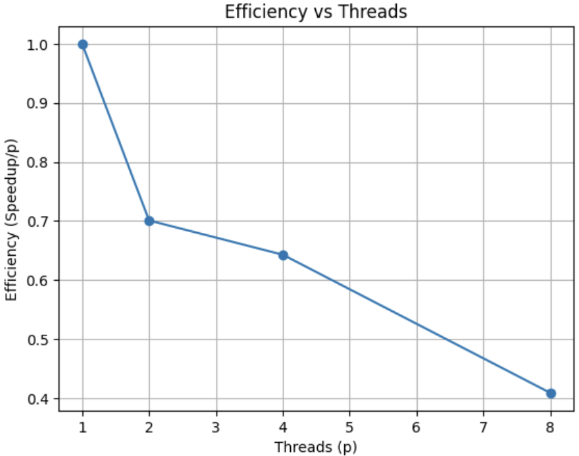

 Parallel Word Count Project 

**Author:** Rana and wafaa
**Course:** Parallel & Distributed Computing  
**Phase:** 1 — Parallelization and Performance Analysis  

---

## Project Overview

The goal of this project is to implement a **Word Count** application using:
- A **sequential (serial)** version.
- A **parallel** version based on **OpenMP**.

The program reads a large text file, tokenizes all words (case-insensitive), counts their occurrences, and prints the top frequent words.

---

## Implementation Details

### sequential Version (`src/wc_serial.cpp`)
- Reads the file line by line.
- Splits words on non-alphanumeric characters.
- Converts all characters to lowercase.
- Uses `unordered_map<string, long long>` to store word frequencies.
- Prints results alphabetically.

### Parallel Version (`src/wc_parallel.cpp`)
- Uses **OpenMP** for multithreading.
- Each thread builds a **local map** to avoid race conditions.
- After processing, all local maps are **merged serially** into a global map.
- Parallel section:
  ```cpp
  #pragma omp parallel
  {
      int tid = omp_get_thread_num();
      auto &mp = local_maps[tid];
      #pragma omp for schedule(static)
      for (...) { /* tokenize & count */ }
  }


  Correctness Check

To verify correctness between serial and parallel versions:

./wc_serial.exe data/big.txt | sort > out_serial.txt
OMP_NUM_THREADS=4 ./wc_parallel.exe data/big.txt 100000 | sort > out_parallel.txt
diff out_serial.txt out_parallel.txt


If no output, both versions match perfectly.

Avoiding Race Conditions

Each thread maintains its own unordered_map → No shared writes.

Final merging happens after all threads finish.

Safer and faster than using #pragma omp critical on shared map.

Performance Results

| Threads (p) |   T_P (s) | Speedup (T_S / T_P) | Efficiency (Speedup/p) |
| ----------: | --------: | ------------------: | ---------------------: |
|           1 |     0.157 |               1.000 |                  1.000 |
|           2 |     0.112 |               1.402 |                  0.701 |
|           4 | 0.0610001 |               2.574 |                  0.643 |
|           8 | 0.0479999 |               3.271 |                  0.409 |


Speedup & Efficiency Graphs
	<table align="center">
  <tr>
    <td align="center"><b>Speedup vs Threads</b></td>
    <td align="center"><b>Efficiency vs Threads</b></td>
  </tr>
  <tr>
    <td></td>
    <td></td>
  </tr>
</table>


Amdahl’s Law

Based on the measured speedup values, the performance follows Amdahl’s Law which states that the maximum speedup of a parallel program is limited by the part of the code that cannot be parallelized. In the results, we see good improvement when going from 1 to 2 and 4 threads, but going from 4 to 8 threads only increases speedup from 2.57 to 3.27. Meanwhile, efficiency drops from 1.00 at 1 thread to only 0.41 at 8 threads. This tells us that the program contains a serial portion that becomes increasingly noticeable as more threads are added. In other words, even though more cores are available, not all threads can stay busy all the time because some work must still be done sequentially. Therefore the application does not scale linearly, it experiences diminishing returns, which is exactly the scalability limit Amdahl’s Law predicts.


Build

g++ -O3 -std=c++17 src/wc_serial.cpp -o wc_serial.exe -Wl,-subsystem,console
g++ -O3 -std=c++17 -fopenmp src/wc_parallel.cpp -o wc_parallel.exe -Wl,-subsystem,console

Run

./wc_serial.exe data/big.txt
OMP_NUM_THREADS=4 ./wc_parallel.exe data/big.txt 10


Amdahl, G. M. (1967). Validity of the Single Processor Approach to Achieving Large Scale Computing Capabilities
