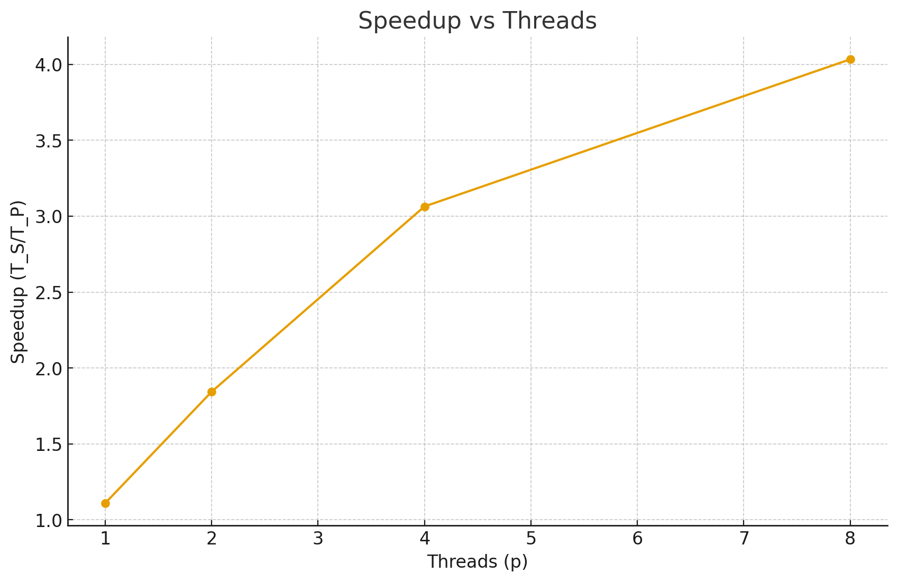
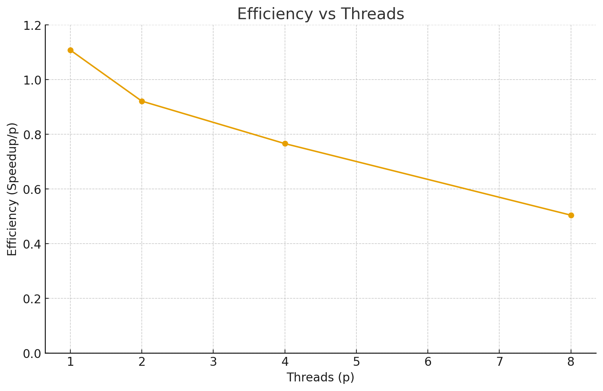

# Parallel Word Count Project 

**Author:** Rana  
**Course:** Parallel & Distributed Computing  
**Phase:** 1 — Parallelization and Performance Analysis  

---

## Project Overview

The goal of this project is to implement a **Word Count** application using:
- A **sequential (serial)** version.
- A **parallel** version based on **OpenMP**.

The program reads a large text file, tokenizes all words (case-insensitive), counts their occurrences, and prints the top frequent words.

---

## Implementation Details

### sequential Version (`src/wc_serial.cpp`)
- Reads the file line by line.
- Splits words on non-alphanumeric characters.
- Converts all characters to lowercase.
- Uses `unordered_map<string, long long>` to store word frequencies.
- Prints results alphabetically.

### Parallel Version (`src/wc_parallel.cpp`)
- Uses **OpenMP** for multithreading.
- Each thread builds a **local map** to avoid race conditions.
- After processing, all local maps are **merged serially** into a global map.
- Parallel section:
  ```cpp
  #pragma omp parallel
  {
      int tid = omp_get_thread_num();
      auto &mp = local_maps[tid];
      #pragma omp for schedule(static)
      for (...) { /* tokenize & count */ }
  }


  Correctness Check

To verify correctness between serial and parallel versions:

./wc_serial.exe data/big.txt | sort > out_serial.txt
OMP_NUM_THREADS=4 ./wc_parallel.exe data/big.txt 100000 | sort > out_parallel.txt
diff out_serial.txt out_parallel.txt


If no output, both versions match perfectly.

Avoiding Race Conditions

Each thread maintains its own unordered_map → No shared writes.

Final merging happens after all threads finish.

Safer and faster than using #pragma omp critical on shared map.

Performance Results
Timing Data
<table>
  <thead>
    <tr>
      <th>Threads (p)</th><th>T_P (ms)</th><th>T_P (s)</th>
      <th>Speedup (T_S/T_P)</th><th>Efficiency (Speedup/p)</th>
    </tr>
  </thead>
  <tbody>
    <tr><td>1</td><td>225.595</td><td>0.2256</td><td>1.108</td><td>1.108</td></tr>
    <tr><td>2</td><td>135.667</td><td>0.1357</td><td>1.842</td><td>0.921</td></tr>
    <tr><td>4</td><td>81.594</td><td>0.0816</td><td>3.064</td><td>0.766</td></tr>
    <tr><td>8</td><td>61.976</td><td>0.0620</td><td>4.032</td><td>0.504</td></tr>
  </tbody>
</table>
<p><strong>Serial baseline T_S ≈ 0.250 s</strong></p>


Speedup & Efficiency Graphs
	<table align="center">
  <tr>
    <td align="center"><b>Speedup vs Threads</b></td>
    <td align="center"><b>Efficiency vs Threads</b></td>
  </tr>
  <tr>
    <td></td>
    <td></td>
  </tr>
</table>


Efficiency vs Threads	
Analysis Summary
Observations

Speedup improves as threads increase, but efficiency decreases gradually.

At 8 threads → ~4× speedup (≈ 50% efficiency).

Caused by:

File I/O being serial.

Merge phase overhead.

Thread synchronization and cache effects.

Amdahl’s Law

Even if 90% of a program is parallelized, the remaining serial part limits total speedup.

This matches the observed results — scaling is sub-linear due to the serial fraction and OpenMP overhead.

Build & Run (Windows/MSYS2 UCRT64)


Build

g++ -O3 -std=c++17 src/wc_serial.cpp -o wc_serial.exe -Wl,-subsystem,console
g++ -O3 -std=c++17 -fopenmp src/wc_parallel.cpp -o wc_parallel.exe -Wl,-subsystem,console

Run

./wc_serial.exe data/big.txt
OMP_NUM_THREADS=4 ./wc_parallel.exe data/big.txt 10

References

OpenMP API Specification v5.2

Amdahl, G. M. (1967). Validity of the Single Processor Approach to Achieving Large Scale Computing Capabilities
